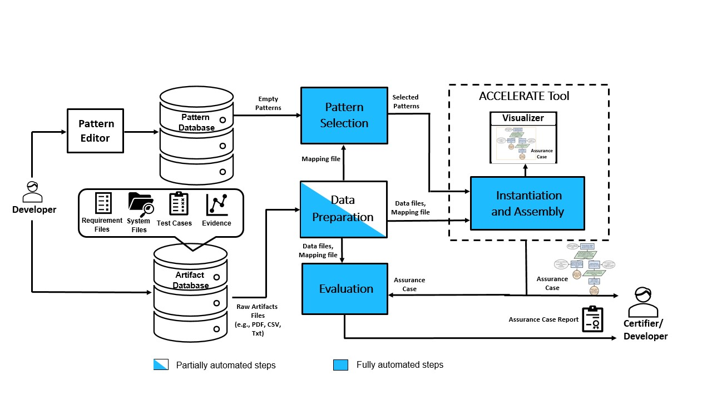

# Automating Pattern Selection for Assurance Case Development of Cyber-Physical Systems

The ever-increasing complexity of cyber-physical systems has made the assurance case development complex, labor-intensive and error-prone. Assurance case fragments called patterns are used to handle the complexity. The state-of-the-art approach has been to manually select generic patterns from online catalogs, instantiate them with system-specific information and assemble them into an assurance case. While there has been some work in automating the instantiation and assembly, an activity that has not been researched is the automation of the pattern selection process, which takes a considerable amount of the assurance case development time. To close this automation gap, we have developed an automated pattern selection workflow that handles the selection problem as a coverage problem, intending to find the smallest set of patterns that can cover the available system artifacts. For this, we utilize the ontology graphs of the system artifacts and the patterns and perform graph analytics. The selected patterns are fed into an external instantiation function to develop an assurance case, then evaluated for coverage using two coverage metrics. We have applied the workflow to develop an assurance case for an Autonomous Vehicle case study in CARLA simulation. The selection process significantly reduces the time and manual efforts required in developing an assurance case.

# Pattern Selection Workflow

  

# Repo Structure

1. The Autonomous Vehicle setup in CARLA simulation is available in the [AV-Carla-Setup](https://github.com/scope-lab-vu/AV-Assurance/tree/main/AV-Carla-Setup) folder. We have developed an evidence generation framework that can be readily used for this example. 

2. The artifacts for the AV example is available in the [Artifacts](https://github.com/scope-lab-vu/AV-Assurance/tree/main/Artifacts) folder. 

3. Sample patterns are available in the [Patterns](https://github.com/scope-lab-vu/AV-Assurance/tree/main/Patterns) folder.

3. Also, sample Assurance Case reports generated by the evaluation function is available in the [AC-Report](https://github.com/scope-lab-vu/AV-Assurance/tree/main/AC-Report) folder.

# ACCELERATE Tool

The tool is under development and will be released in the coming months. Please check back for the release information
